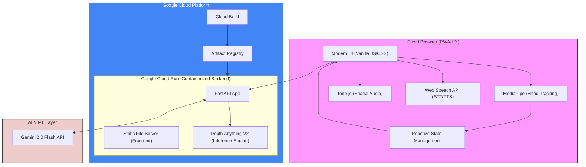

```mermaid
graph TD
    subgraph Client ["Client Browser (PWA/UX)"]
        UI["Modern UI (Vanilla JS/CSS)"]
        MP["MediaPipe (Hand Tracking)"]
        Tone["Tone.js (Spatial Audio)"]
        WS["Web Speech API (STT/TTS)"]
        State["Reactive State Management"]
    end

    subgraph GCP ["Google Cloud Platform"]
        subgraph CloudRun ["Google Cloud Run (Containerized Backend)"]
            FastAPI["FastAPI App"]
            Static["Static File Server (Frontend)"]
            Depth["Depth Anything V2 (Inference Engine)"]
        end
        AR["Artifact Registry"]
        CB["Cloud Build"]
    end

    subgraph AI ["AI & ML Layer"]
        Gemini["Gemini 2.0 Flash API"]
    end

    %% Interactions
    UI --> MP
    MP --> State
    State --> UI
    UI --> Tone
    UI --> WS

    %% Backend Communication
    UI <--> FastAPI
    FastAPI <--> Gemini
    FastAPI --> Depth
    
    %% Deployment flow
    CB --> AR
    AR --> CloudRun
    
    %% Formatting
    style Client fill:#f9f,stroke:#333,stroke-width:2px
    style GCP fill:#4285F4,stroke:#fff,stroke-width:2px,color:#fff
    style AI fill:#ecc,stroke:#333,stroke-width:2px
```
